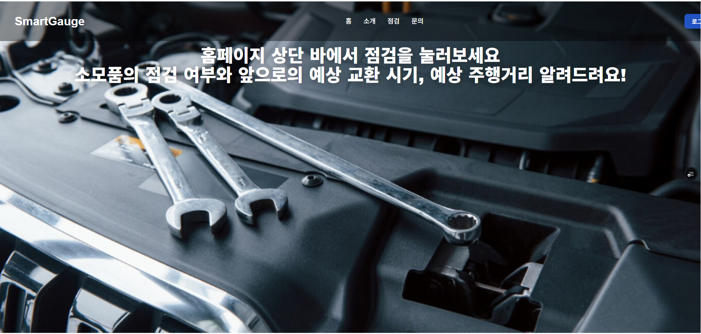
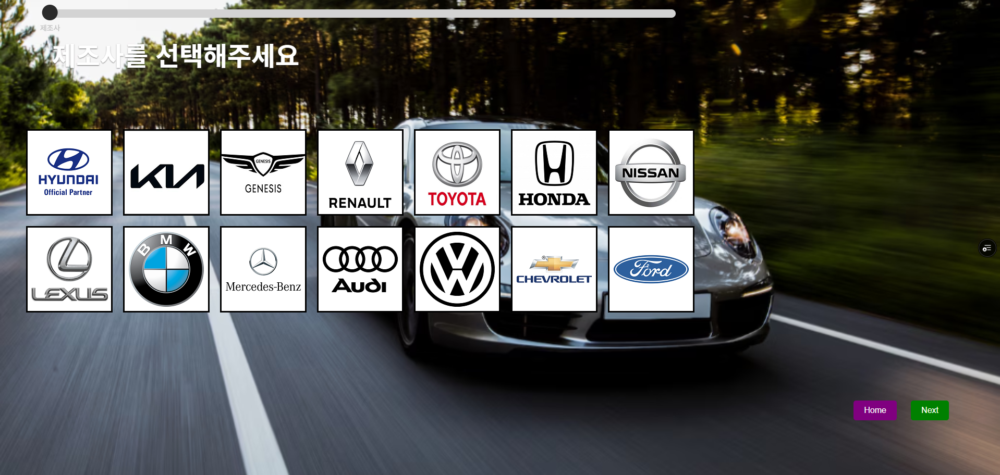
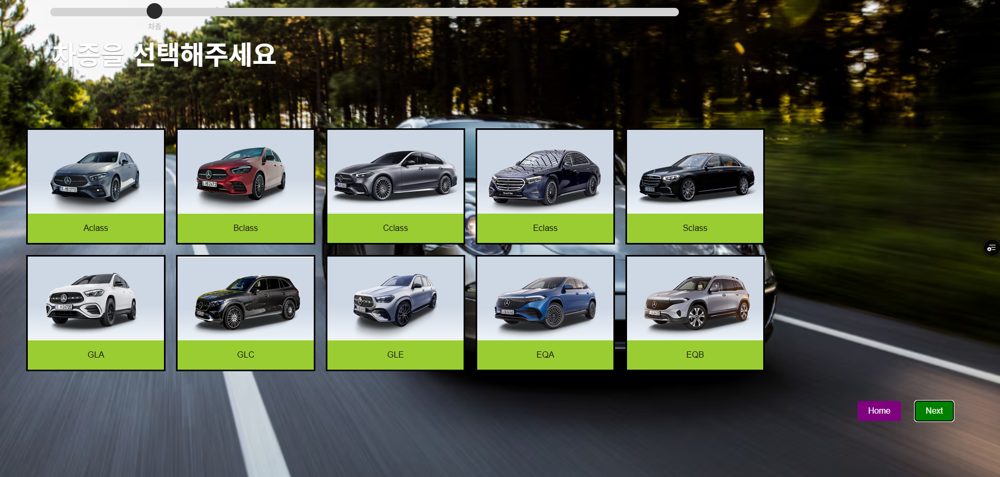
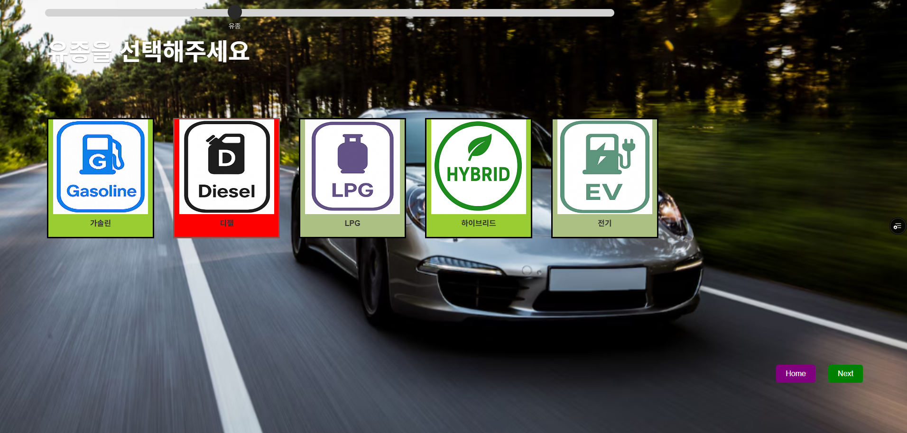
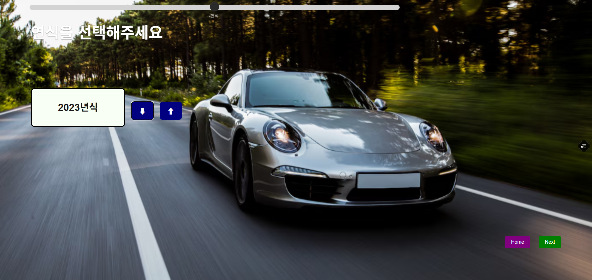
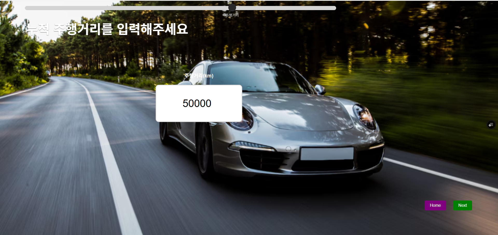
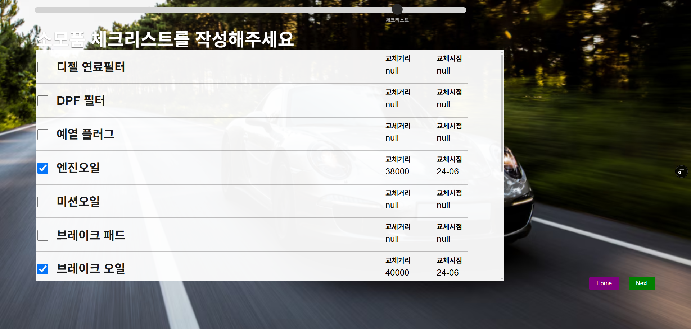
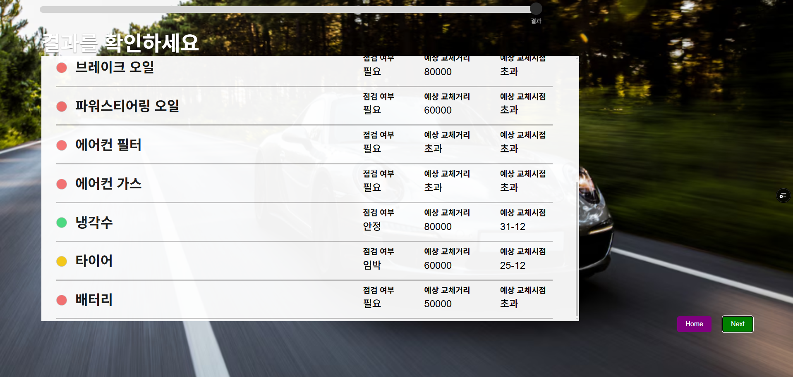

### 1. 팀원

**프로젝트명**: 차량 소모품 관리 웹서비스

**배포**: [**https://next-js-refactoring.vercel.app/**](https://next-js-refactoring.vercel.app/)

**기간**: 2025.03 – 05(Next.js 리팩토링 + Vercel 배포 + 홈페이지 구현 완료)

**개발자**: 조홍래 **(Frontend)**(1인 총괄)

**깃허브: [https://github.com/louis2487](https://github.com/louis2487/Next.js_Refactoring)**

### 2. 프로젝트 개요

**소개**

 차량을 소유한 사용자가 엔진오일, 브레이크 패드 등의 교체 시기를 쉽게 확인할 수 있도록 도와주는 웹 애플리케이션입니다. 차량 등록 정보와 체크리스트를 기반으로 소모품 상태를 계산하여 시각적으로 제공하며, 점검여부, 예상 교체주기 및 예상 교체거리를 누구나 쉽게 확인할 수 있게 만들었습니다.

**개발 동기**

 아반떼 HD 10년식 7만km차를 처음으로 소유한 뒤, 한 달만에 배터리, 냉각수, 브레이크 오일, 브레이크 패드 등을 교체하면서, 차량 소모품 교체주기에 대해 강력한 관심을 가지게 되었고, 중고차를 구매하거나, 연식이 오래되어 점검이 필요한 차주들에게 시각적으로 점검 상태를 보여주고, 소모품 교체 기준을 확립할 수 있는 웹서비스를 직접 구현해보고 싶었습니다.

**사용 기술**

- **Frontend**: TypeScript, Next.js, React, Redux, React Router Dom, HTML, CSS, JavaScrpit, Vite
- **State Management**: Redux Slice
- **Deployment**: Vercel, Firebase

### 3. 전체 흐름

- **홈 화면**
    
    
    

- **소개 화면**
    
    
    

- **문의 화면**
    
    

- **점검 - Step 0. 제조사 선택**
    
    
    

- **점검 - Step 1. 차종 선택**
    
    
    

- **점검 - Step 2. 유종 선택**
    
    
    

- **점검 - Step 3. 연식 선택**
    
    
    

- **점검 - Step 4. 누적 주행거리 입력**
    
    
    

- **점검 - Step 5. 체크리스트 작성**
    
    
    

- **점검 - Step 6. 결과 확인**
    
    

### 4. 구조 설계

 - **1. Redux 상태 관리**
    
    carSlice와 checklistSlice로 나누어 전역 상태를 관리하였습니다.
    
    carSlice : 진행 단계, 유종리스트와 브랜드, 모델, 유종, 연식, 주행거리의 사용자의 차량 등록 정보를 관리합니다.
    
    checklistSlice : 소모품의 이름, 마지막 교환 거리, 마지막 교환 시기, 적정 교환 거리, 적정 교환 시기, 남은 교환 거리, 남은 교환 시기, 점검 여부에 대한 상태를 관리합니다.
    

 - **2. React Router Dom 관리**
    
    전체 흐름은 총 7단계로 구성되어 있으며, 각 단계를 전역상태인 step으로 판단하고, 상단 툴바 및     Next버튼은 step이라는 사용자의 진행 상태에 따라 React Router Dom을 통해 적절한 화면 레이아웃(jsx)으로  라우팅 처리하였습니다.
    
    상단 툴바 및 버튼의 해당 jsx파일은 공통 부분으로 라우팅하였으며, 화면 전환 시 step을 Dispatch()로 증가시키며, 제조사, 모델, 유종 등에 따라 동적인 라우팅이 가능하도록, 해당 이미지 클릭 시 Dispatch로 carSlice로 차량의 정보를 저장한 뒤, 화면전환시 해당 정보와 같은 URL을 라우팅하여 기능을 구현하였습니다.

 - **Next.js 리팩토링(2차 홈페이지 구현)**

     CSR/SSR/SSG/ISG의 다양한 렌더링 환경을 지원하는 Next.js를 실무에서 사용하는 흐름에 맞추어, 신입으로써 역량 강화를 위해 Redux-Toolkit으로 개발한 SPA를 Next.js를 통해 웹 페이지로 리빌딩하였습니다. layout.tsx를 통해 홈페이지 링크 구현 및 기존 SPA의 공통 라우팅 영역이었던 상단 툴바를 Path 경로에 따라 조건부 랜더링하였으며, Page.tsx 파일들을 폴더 구조에 따라 라우팅하였습니다.

### 5. 문제 해결

 **1. 사용자 맞춤형 체크리스트의 동적 관리**

 ‘사용자가 등록한 정보를 가지고, 맞춤형 소모품 교환주기를 어떻게 제공할 것인가?’에 대한 고뇌가 있었습니다. 처음에는 제조사에 따른 소모품의 분류를 생각해봤지만,  제조사별 워런티 보증 전략에 차이로 인해, 일부 제조사는 소모품 교환 주기를 일반적인 차의 라이프타임보다 길게 잡는 경향이 많았으며, 어떤 제조사는 짧은 교환주기를 통해, 차의 운용 수명을 늘리는 방향을 선호하는 경우도 있었습니다. 해당 문제를 해결하기위해 웹서핑을 통해 여러 센터 정비사들의 범용적인 정비주기를 조사한 후, 사용자가 입력한 정보를 바탕으로, 적정 시기나 적정 주행거리를 지난 경우 점검 필요, 적정 주기나 교환거리의 1/3 이내인 경우 임박, 그 외에 경우 안정을 제공하며, ‘내 차에 교환해야 할 소모품이 무엇인가?’, ‘현재 점검이 필요한 상태인가?’에 대한 두 질문에 답을 할 수 있도록 하는데 중점을 두었습니다.

### 6. Github Source

 **Source 링크 :** https://github.com/louis2487/Next.js_Refactoring/tree/master/src

### 7. 배포

Vercel 사용

 **배포링크**: [**https://next-js-refactoring.vercel.app/**](https://next-js-refactoring.vercel.app/)
